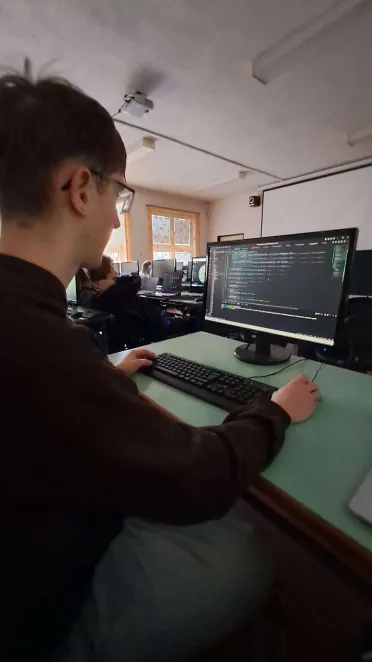
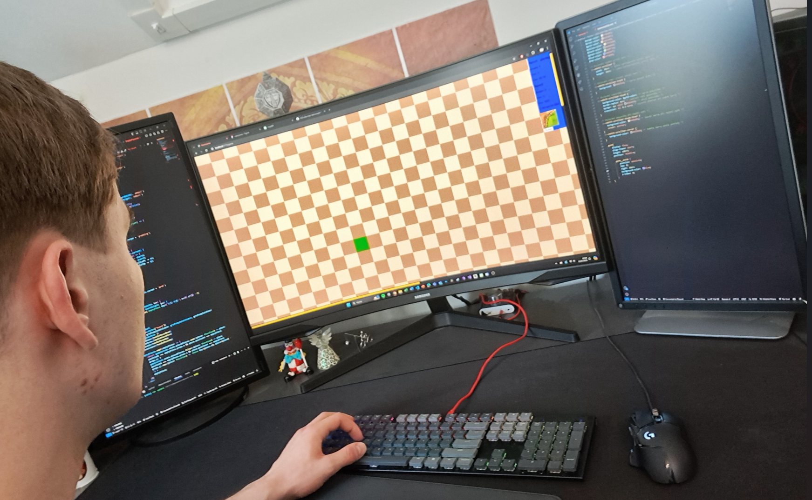

# Město Reactssonne

# Pages - [GitHub Pages](https://pslib-cz.github.io/2023-p3a-mpa-react-project-TomasKelbasa-IvanKraus/)

## Developeři
- [Tomáš Kelbasa](https://github.com/TomasKelbasa) - brainstorm professional, fullstack programmer, cybernetic specialist, scratch senior programmer
  
- [Ivan Kraus](https://github.com/KrausIvan) - Browser engine optimizer, react optimizer, memo optimizer, figma specialist, fullstack developer, network engineer, UX & UI designer, copywritter, big data specialist
  

## Téma

Předělávka známé deskové hry [Carcassonne](https://www.zatrolene-hry.cz/spolecenska-hra/carcassonne-8/).
Hra bude pro dva hráče.

## Figma design

https://www.figma.com/file/5vMA4hZmWaYrlaBD8ajpZP/Untitled?type=design&node-id=0-1&mode=design&t=TYaw6hWEpXABnzl1-0

### Techniky

- ✔️ využití localStorage / sessionStorage
- ❌ čtení dat z externího RestAPI (fetch)
- ✔️ operace DnD
- ✔️ využití react-routeru
- ❌ funkčnost na mobilu (výjimka je předělávka komplexních deskových her) (sem určitě spadáme :) )

### Co není obsahem 

- databáze
- bez vlastních backend service
- trapné věci: *klasické karetní hry*, *člověče nezlob se*, ...
